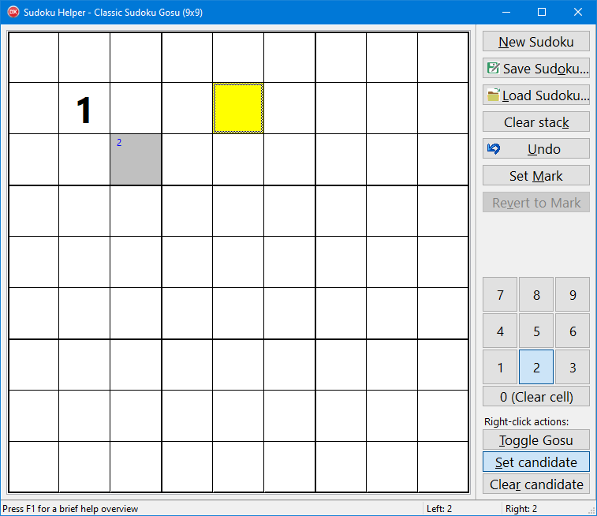

# SudokuHelper

Copyright © 2021 by Dr. Peter Below.
Adapted by Federgraph in the forked repository.

SudokuHelper is an application that acts like an electronic Sudoku grid.

It supports 9x9, 12x12, and 16x16 Sudokus, both in the classic and Gosu variant, where cells can be marked to only accept even numbers.

The application neither creates Sudokus itself nor provides a solver for them; it is just a more convenient way to solve a Sudoku from a magazine or other external source than doing it on paper, using pencil and eraser.

The application's main features are:
- Invalid cell values are marked in red.
- Candidate values can be added and removed from a cell. Setting a cell's value will automatically remove candidates no longer possible in other cells.
- All actions can be undone, the undo stack is only limited by available memory.
- Named marks can be set for the current undo stack state and one can later restore the stack to such a named mark.
- The complete Sudoku can be saved to a binary file, including the undo stack, and later loaded again from such a file.
- The current state can also be written as text, excluding the undo stack.

<a href="../images/SH01-01.png">*Screenshot of SH01* 
</a>

## Basics of operation

### Navigating the Grid

The active cell is marked in yellow, or blue (aqua) for a Gosu cell.

- Use cursor keys to move one cell up, down, left or right.
- **HOME** moves to the first cell in the row.
- **END** moves to the last cell in the row.
- **PageUp** moves to the top cell in the column.
- **PageDown** moves to the bottom cell in the column.

### Setting cell values with keyboard

To set a cell's value just type the value:
- 0 to clear the cell,
- 1 to 9 to set the cell value.
- a to g for values 10 to 16 (for 12x12 and 16x16 Sudokus)

### Setting values and candidates with mouse

To set a normal value:
  Click on one of the numbered buttons to SELECT the value,
  followed by a left click on a cell in the grid to PLACE the value.

To set a candidate use right mouse button:
1. Make sure the value is selected (button is down).
2. Make sure the right click mode is set appropriately.
   You can use Shift or Control keys to set the right click mode.
3. Then right click a cell.

## Sudoku commands

The buttons on the top part of the right-hand panel perform the following functions:

- **New Sudoku** Shows a list of the Sudoku types the application can handle. Select the one you want and click OK. A new empty Sudoku is created and both grid and value buttons are adjusted as needed.
- **Save Sudoku** A File Save dialog is shown. It remembers the last folder you saved a Sudoku to or loaded one from. Enter a filename and click the dialog's Save button to store the current Sudoku, including the Undo stack, to the file.
- **Load Sudoku** A File Open dialog is shown. It remembers the last folder you saved a Sudoku to or loaded one from. Pick a filename and click the dialog's Open button to replace the current Sudoku, including the Undo stack, with the one saved to the file.
- **Clear stack** Discards all items on the Undo stack, including all stack marks. The button is only enabled if the stack is not empty.
- **Undo** Undoes the last user action that changed the Sudoku's content, including the candidates. The button is only enabled if the stack is not empty.
- **Set Mark** Pops up a simple dialog where you can enter a name for the mark to create. It then represents the current state of the undo stack.
- **Revert to Mark** Pops up a list of the defined stack marks. Select the one you want to revert to and click OK. The application then undoes all changes done after the mark was set. The button is only enabled if there is at least one stack mark defined.
- **Show Memo** should show a secondary form with Save and Load buttons.
The save text button will write the current state of the Sudoku to the memo control.
It should be possible to edit the text and load again.
Also you should be able to copy text via clipboard and load.