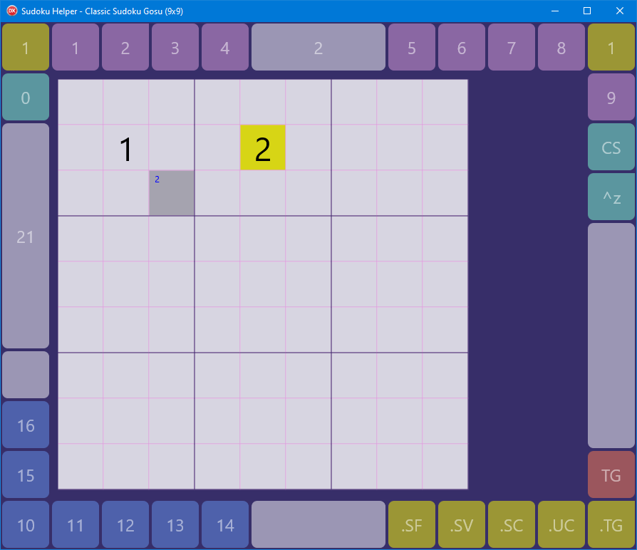

# SudokuHelper App SH02

> Compare to original SudokuHelper [help text](../SH01/helptext.md) by Dr. Peter Below.

The text below is being adapted by *Federgraph* for the purpose of FMX application SH02.

---

**SudokuHelper** is an application that acts like an electronic Sudoku grid.
It supports 9x9, 12x12, and 16x16 Sudokus, both in the classic and Gosu variant,
where cells can be marked to only accept even numbers.
The application neither creates Sudokus itself nor provides a solver for them;
it is just a more convenient way to solve a Sudoku from a magazine
or other external source than doing it on paper,
using pencil and eraser.

The application's main features should be:
- Invalid cell values marked in alternative color red. 
- It should be possible to add and remove *candidate values* from a cell.
- Setting a cell's value should automatically remove candidates no longer possible in other cells. 
- There should be an *undo stack* feature, so that all actions can be undone. 
- Then there should be a feature called *named marks*, which can be set for the current undo stack state. 
- And it should be possible to save the Sudoku to a file, including the undo stack.

<a href="../images/SH02-01.png">*Screenshot of SH02* 
</a>

In the image above you can see:
- SH02 FMX app with Classic Sudoku Gosu (9x9) template loaded
- the button frame with page 1 (of 3) shown
- two yellow buttons for navigating button pages
- button 0 - 16 for selection of values (Aquamarine, Plum, CornflowerBlue)
- the sudoku grid image in the center
- a cell with assigned value of 1
- a selected (focused) cell with a value of 2 already placed
- a Gosu cell with a candidate value of 2 set
- the .TG click mode active (top left corner of button not rounded)
- the ^z button for undo action
- the CS button for clearing the undo stack
- currently selected value 2 shown on the top touch bar
- DrawCounter 21 shown on the left touch bar (for debugging)

## Basics of operation

### Navigating the Grid

The active cell is marked in yellow, or blue (aqua) for a Gosu cell.

When keyboard is available:
- Use **cursor keys** to move one cell up, down, left or right.
- **Home** moves to the first cell in the row (Pos1).
- **End** moves to the last cell in the row (Ende).
- **PageUp** moves to the top cell in the column (Bild auf).
- **PageDown** moves to the bottom cell in the column (Bild ab).

When mouse is available you can use wheel and shift wheel,
or use left button click when in click mode SetFocus.

On a touch screen device you can use bottom and right touch bar of the button frame instead of mouse wheel,
or simply tap a cell when in click mode SetFocus.

### Setting cell values with keyboard

To set a cell's value just type the value:
- 0 to clear a cell,
- 1 to 9 to set the cell value.

For 12x12 and 16x16 Sudokus the letters A to G will set the values 10 to 16,
these characters are not case-sensitive.

### Setting values and candidates with mouse

First make sure to set the click mode with one of the yellow frame buttons,
then click on one of the numbered buttons to SELECT the value,
followed by a click on a cell in the grid to PLACE the value.

Value 0 will clear the cell.

Only empty cells can have candidates.
To set candidates with the left mouse button
make sure the SetCandidates click mode is active.

On the desktop you can alternatively make use of the right mouse button,
it should work together with modifier keys Alt (set candidate) or Ctrl (remove candidate).
This should work independent of the selected click mode.

### How to toggle Gosu cell state

- If keyboard is available use Spacebar to toggle the state.
- Or use TG button on the button frame to toggle the state of the active cell.
- Or tap / click a cell, while *ToggleGosu* click mode is active.

## Sudoku commands

These commands affect the whole Sudoku, not just a single cell.

Some of the commands should work already:

- **Undo** should undo the last user action that changed the Sudoku's content,
including the candidates.
Nothing should happen if the stack is empty.
(This action used to be enabled only if the stack is not empty,
but the button frame buttons currently cannot show the enabled state.)
- **Clear stack** should discard all items on the Undo stack,
including all stack marks.
(The action should only be enabled if the stack is not empty.)
- **Save Sudoku** should bring up a File Save dialog.
It should remember the last folder you saved a Sudoku to, or loaded one from.
Enter a filename and click the dialog's Save button to store the current Sudoku,
including the Undo stack, to the file. 
- **Load Sudoku** should bring up a File Open dialog.
It should remember the last folder you saved a Sudoku to or loaded one from.
Pick a filename and click the dialog's Open button to replace the current Sudoku,
including the Undo stack, with the one saved to the file. 

Other actions are not implemented yet:

- **New Sudoku** should show a list of the Sudoku types the application can handle.
Select the one you want and click OK to create a new empty Sudoku. 
- **Set Mark** should pop up a simple dialog where you can enter a name for the mark to create.
It then represents the current state of the undo stack. 
- **Revert to Mark** should pop up a list of the defined stack marks.
Select the one you want to revert to and click OK.
The application should then undo all changes done after the mark was set.
(This action should only be enabled if there is at least one stack mark defined.)